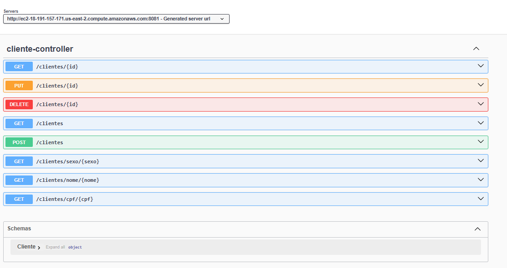

# 📋 Customer Registration API — Java Spring Boot + AWS

> 🇧🇷 [Português](#português) | 🇺🇸 [English](#english)



---

## Português

### Sobre o Projeto

> API REST de clientes em Java/Spring Boot com deploy na AWS.

API REST para gerenciamento de clientes, desenvolvida como projeto final de um curso de Java Spring Boot com deploy na AWS. O sistema permite cadastrar, consultar, atualizar e excluir clientes, com persistência em banco de dados PostgreSQL hospedado no Amazon RDS.

### Tecnologias Utilizadas

| Camada | Tecnologia |
|---|---|
| Linguagem | Java 17 |
| Framework | Spring Boot 4 |
| Persistência | Spring Data JPA + PostgreSQL |
| Documentação | Swagger / OpenAPI (SpringDoc) |
| Build | Maven |
| Containerização | Docker |
| Banco de Dados | Amazon RDS (PostgreSQL) |
| Servidor | Amazon EC2 |
| Versionamento | GitLab |

### Endpoints

```
POST    /clientes
GET     /clientes
GET     /clientes/{id}
GET     /clientes/cpf/{cpf}
GET     /clientes/nome/{nome}
GET     /clientes/sexo/{sexo}
PUT     /clientes/{id}
DELETE  /clientes/{id}
```

### Aprendizado

- Estruturar uma API REST com a arquitetura em camadas **Controller → Service → Repository → Model**
- Integrar o Spring Boot com banco de dados relacional usando **Spring Data JPA**
- Documentar endpoints automaticamente com **Swagger/OpenAPI**
- Containerizar a aplicação com **Docker**
- Fazer deploy de uma aplicação Java em uma instância **AWS EC2**
- Provisionar e conectar um banco de dados gerenciado no **Amazon RDS**
- Versionar o projeto com **GitLab**

### Como executar localmente

```bash
# Clone o repositório
git clone <url-do-repositorio>

# Configure o banco no application.properties
spring.datasource.url=jdbc:postgresql://localhost:5432/postgres
spring.datasource.username=postgres
spring.datasource.password=<sua-senha>

# Execute com Maven
cd backend
./mvnw spring-boot:run
```

Acesse a documentação em: `http://localhost:8080/swagger-ui.html`

---

## English

### About

> Customer REST API built with Java/Spring Boot and deployed on AWS.

REST API for customer management, built as the final project of a Java Spring Boot + AWS course. It supports full CRUD operations with data persisted in a PostgreSQL database hosted on Amazon RDS.

### Tech Stack

| Layer | Technology |
|---|---|
| Language | Java 17 |
| Framework | Spring Boot 4 |
| Persistence | Spring Data JPA + PostgreSQL |
| Documentation | Swagger / OpenAPI (SpringDoc) |
| Build | Maven |
| Containerization | Docker |
| Database | Amazon RDS (PostgreSQL) |
| Server | Amazon EC2 |
| Version Control | GitLab |

### What I learned

- Layered REST API architecture: **Controller → Service → Repository → Model**
- Database integration with **Spring Data JPA**
- Automatic API documentation with **Swagger/OpenAPI**
- Containerizing a Java app with **Docker**
- Deploying to **AWS EC2** and connecting to **Amazon RDS**
- Version control workflow with **GitLab**
